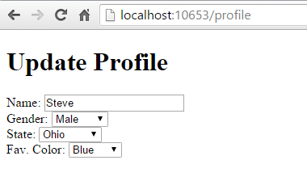

# Dependency injection into views in ASP.NET Core

ASP.NET Core supports [dependency injection](../fundamentals/dependency-injection.md) into views. This can be useful for view-specific services, such as localization or data required only for populating view elements. Most of the data views display should be passed in from the controller.

## Configuration injection

The values in settings files, such as `appsettings.json` and `appsettings.Development.json`, can be injected into a view.


For more information, see <xref:fundamentals/configuration/index>

## Service injection

A service can be injected into a view using the `@inject` directive.

[!code-cshtml](https://learn.microsoft.com/en-us/aspnet/core/mvc/views/dependency-injection?view=aspnetcore-7.0)


The sample repository uses an in-memory collection. An in-memory implementation shouldn't be used for large, remotely accessed data sets.

The sample displays data from the model bound to the view and the service injected into the view:


## Populating Lookup Data

View injection can be useful to populate options in UI elements, such as dropdown lists. Consider a user profile form that includes options for specifying gender, state, and other preferences. Rendering such a form using a standard approach might require the controller or Razor Page to:

* Request data access services for each of the sets of options.
* Populate a model or `ViewBag` with each set of options to be bound.

An alternative approach injects services directly into the view to obtain the options. This minimizes the amount of code required by the controller or razor Page, moving this view element construction logic into the view itself. The controller action or Razor Page to display a profile editing form only needs to pass the form the profile instance.


The HTML form used to update the preferences includes dropdown lists for three of the properties:




ASP.NET Core supports [dependency injection](../fundamentals/dependency-injection.md) into views. This can be useful for view-specific services, such as localization or data required only for populating view elements. You should try to maintain [separation of concerns](/dotnet/standard/modern-web-apps-azure-architecture/architectural-principles#separation-of-concerns) between your controllers and views. Most of the data your views display should be passed in from the controller.


## Configuration injection

`appsettings.json` values can be injected directly into a view.

Example of an `appsettings.json` file:

```json
{
   "root": {
      "parent": {
         "child": "myvalue"
      }
   }
}
```

The syntax for `@inject`:
   `@inject <type> <name>`

An example using `@inject`:

```csharp
@using Microsoft.Extensions.Configuration
@inject IConfiguration Configuration
@{
   string myValue = Configuration["root:parent:child"];
   ...
}
```

## Service injection

A service can be injected into a view using the `@inject` directive. You can think of `@inject` as adding a property to the view, and populating the property using DI.


> [!IMPORTANT]
> Don't forget to register types you request through dependency injection in `Startup.ConfigureServices`. An unregistered type throws an exception at runtime because the service provider is internally queried via <xref:Microsoft.Extensions.DependencyInjection.ServiceProviderServiceExtensions.GetRequiredService%2A>.
