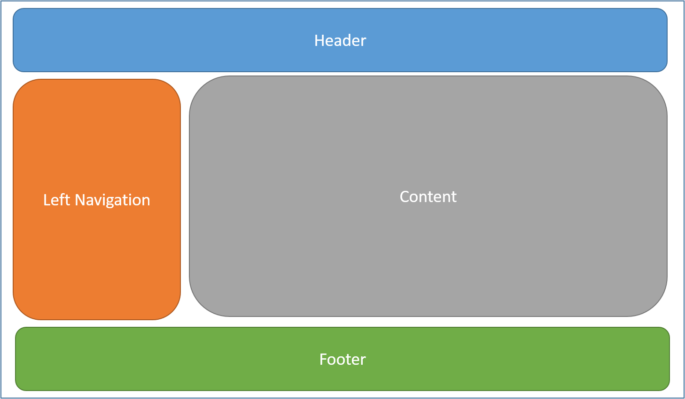
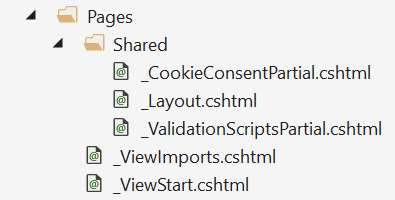
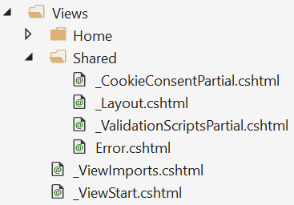

# Layout in ASP.NET Core


Pages and views frequently share visual and programmatic elements. This article demonstrates how to:

* Use common layouts.
* Share directives.
* Run common code before rendering pages or views.

This document discusses layouts for the two different approaches to ASP.NET Core MVC: Razor Pages and controllers with views. For this topic, the differences are minimal:

* Razor Pages are in the *Pages* folder.
* Controllers with views uses a *Views* folder for views.

## What is a Layout

Most web apps have a common layout that provides the user with a consistent experience as they navigate from page to page. The layout typically includes common user interface elements such as the app header, navigation or menu elements, and footer.



Common HTML structures such as scripts and stylesheets are also frequently used by many pages within an app. All of these shared elements may be defined in a *layout* file, which can then be referenced by any view used within the app. Layouts reduce duplicate code in views.

By convention, the default layout for an ASP.NET Core app is named `_Layout.cshtml`. The layout files for new ASP.NET Core projects created with the templates are:

* Razor Pages: `Pages/Shared/_Layout.cshtml`

  

* Controller with views: `Views/Shared/_Layout.cshtml`

  

The layout defines a top level template for views in the app. Apps don't require a layout. Apps can define more than one layout, with different views specifying different layouts.

## Specifying a Layout


The layout specified can use a full path (for example, `/Pages/Shared/_Layout.cshtml` or `/Views/Shared/_Layout.cshtml`) or a partial name (example: `_Layout`). When a partial name is provided, the Razor view engine searches for the layout file using its standard discovery process. The folder where the handler method (or controller) exists is searched first, followed by the *Shared* folder. 

By default, every layout must call `RenderBody`. Wherever the call to `RenderBody` is placed, the contents of the view will be rendered.

<a name="layout-sections-label"></a>
<!-- https://stackoverflow.com/questions/23327578 -->
### Sections

A layout can optionally reference one or more *sections*, by calling `RenderSection`. Sections provide a way to organize where certain page elements should be placed. Each call to `RenderSection` can specify whether that section is required or optional:

```html
<script type="text/javascript" src="~/scripts/global.js"></script>

@RenderSection("Scripts", required: false)
```

If a required section isn't found, an exception is thrown. Individual views specify the content to be rendered within a section using the `@section` Razor syntax. If a page or view defines a section, it must be rendered (or an error will occur).

An example `@section` definition in Razor Pages view:

```html
@section Scripts {
     <script type="text/javascript" src="~/scripts/main.js"></script>
}
```

In the preceding code, `scripts/main.js` is added to the `scripts` section on a page or view. Other pages or views in the same app might not require this script and wouldn't define a scripts section.


```html
@section Scripts {
    <partial name="_ValidationScriptsPartial" />
}
```

Sections defined in a page or view are available only in its immediate layout page. They cannot be referenced from partials, view components, or other parts of the view system.

### Ignoring sections

By default, the body and all sections in a content page must all be rendered by the layout page. The Razor view engine enforces this by tracking whether the body and each section have been rendered.

To instruct the view engine to ignore the body or sections, call the `IgnoreBody` and `IgnoreSection` methods.

The body and every section in a Razor page must be either rendered or ignored.

<a name="viewimports"></a>

## Importing Shared Directives

Views and pages can use Razor directives to import namespaces and use [dependency injection](dependency-injection.md). Directives shared by many views may be specified in a common `_ViewImports.cshtml` file. The `_ViewImports` file supports the following directives:

* `@addTagHelper`
* `@removeTagHelper`
* `@tagHelperPrefix`
* `@using`
* `@model`
* `@inherits`
* `@inject`
* `@namespace`

The file doesn't support other Razor features, such as functions and section definitions.


The `_ViewImports.cshtml` file for an ASP.NET Core MVC app is typically placed in the *Pages* (or *Views*) folder. A `_ViewImports.cshtml` file can be placed within any folder, in which case it will only be applied to pages or views within that folder and its subfolders. `_ViewImports` files are processed starting at the root level and then for each folder leading up to the location of the page or view itself. `_ViewImports` settings specified at the root level may be overridden at the folder level.

For example, suppose:

* The  root level `_ViewImports.cshtml` file includes `@model MyModel1` and `@addTagHelper *, MyTagHelper1`.
* A subfolder  `_ViewImports.cshtml` file includes `@model MyModel2` and `@addTagHelper *, MyTagHelper2`.

Pages and views in the subfolder will have access to both Tag Helpers and the `MyModel2` model.

If multiple `_ViewImports.cshtml` files are found in the file hierarchy, the combined behavior of the directives are:

* `@addTagHelper`, `@removeTagHelper`: all run, in order
* `@tagHelperPrefix`: the closest one to the view overrides any others
* `@model`: the closest one to the view overrides any others
* `@inherits`: the closest one to the view overrides any others
* `@using`: all are included; duplicates are ignored
* `@inject`: for each property, the closest one to the view overrides any others with the same property name

<a name="viewstart"></a>

## Running Code Before Each View

Code that needs to run before each view or page should be placed in the `_ViewStart.cshtml` file. By convention, the `_ViewStart.cshtml` file is located in the *Pages* (or *Views*) folder. The statements listed in `_ViewStart.cshtml` are run before every full view (not layouts, and not partial views). Like  `_ViewStart.cshtml` is hierarchical. If a `_ViewStart.cshtml` file is defined in the view or pages folder, it will be run after the one defined in the root of the *Pages* (or *Views*) folder (if any).
