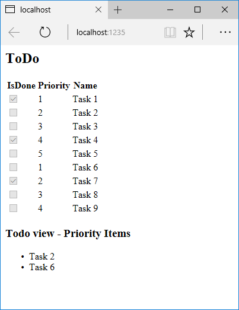
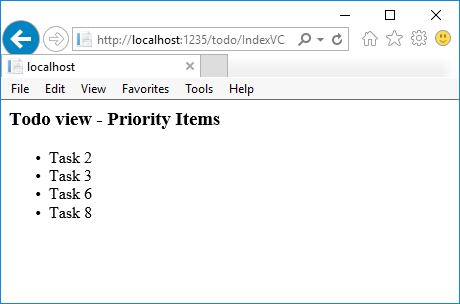
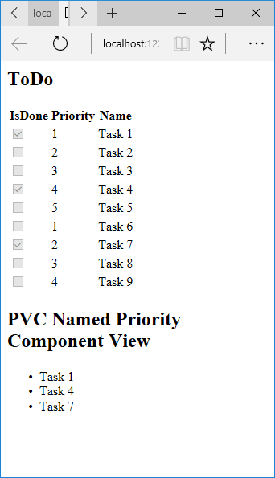
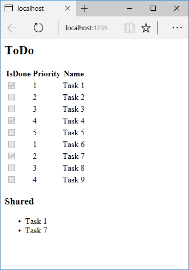

# View components in ASP.NET Core


## View components

View components are similar to partial views, but they're much more powerful. View components don't use model binding, they depend on the data passed when calling the view component. This article was written using controllers and views, but view components work with [Razor Pages](https://www.learnrazorpages.com/razor-pages/view-components).

A view component:

* Renders a chunk rather than a whole response.
* Includes the same separation-of-concerns and testability benefits found between a controller and view.
* Can have parameters and business logic.
* Is typically invoked from a layout page.

View components are intended anywhere reusable rendering logic that's too complex for a partial view, such as:

* Dynamic navigation menus
* Tag cloud, where it queries the database
* Sign in panel
* Shopping cart
* Recently published articles
* Sidebar content on a blog
* A sign in panel that would be rendered on every page and show either the links to sign out or sign in, depending on the sign in state of the user

A view component consists of two parts:

* The class, typically derived from <xref:Microsoft.AspNetCore.Mvc.ViewComponent>
* The result it returns, typically a view.

Like controllers, a view component can be a POCO, but most developers take advantage of the methods and properties available by deriving from <xref:Microsoft.AspNetCore.Mvc.ViewComponent>.

When considering if view components meet an app's specifications, consider using Razor components instead. Razor components also combine markup with C# code to produce reusable UI units. Razor components are designed for developer productivity when providing client-side UI logic and composition. For more information, see <xref:blazor/components/index>. For information on how to incorporate Razor components into an MVC or Razor Pages app, see <xref:blazor/components/prerendering-and-integration?pivots=server>.

## Create a view component

This section contains the high-level requirements to create a view component. Later in the article, we'll examine each step in detail and create a view component.

### The view component class

A view component class can be created by any of the following:

* Deriving from <xref:Microsoft.AspNetCore.Mvc.ViewComponent>
* Decorating a class with the [`[ViewComponent]`](xref:Microsoft.AspNetCore.Mvc.ViewComponentAttribute) attribute, or deriving from a class with the `[ViewComponent]` attribute
* Creating a class where the name ends with the suffix [`ViewComponent`](xref:Microsoft.AspNetCore.Mvc.ViewComponents)

Like controllers, view components must be public, non-nested, and non-abstract classes. The view component name is the class name with the `ViewComponent` suffix removed. It can also be explicitly specified using the <xref:Microsoft.AspNetCore.Mvc.ViewComponentAttribute.Name%2A> property.

A view component class:

* Supports constructor [dependency injection](../fundamentals/dependency-injection.md)
* Doesn't take part in the controller lifecycle, therefore [filters](../controllers/filters.md) can't be used in a view component

To prevent a class that has a case-insensitive `ViewComponent` suffix from being treated as a view component, decorate the class with the attribute.

### View component methods

A view component defines its logic in an:

* `InvokeAsync` method that returns `Task<IViewComponentResult>`.
* `Invoke` synchronous method that returns an <xref:Microsoft.AspNetCore.Mvc.IViewComponentResult>.

Parameters come directly from invocation of the view component, not from model binding. A view component never directly handles a request. Typically, a view component initializes a model and passes it to a view by calling the `View` method. In summary, view component methods:

* Define an `InvokeAsync` method that returns a `Task<IViewComponentResult>` or a synchronous `Invoke` method that returns an `IViewComponentResult`.
* Typically initializes a model and passes it to a view by calling the [ViewComponent.View](xref:Microsoft.AspNetCore.Mvc.ViewComponent.View) method.
* Parameters come from the calling method, not HTTP. There's no model binding.
* Aren't reachable directly as an HTTP endpoint. They're typically invoked in a view. A view component never handles a request.
* Are overloaded on the signature rather than any details from the current HTTP request.

### View search path

The runtime searches for the view in the following paths:

* /Views/{Controller Name}/Components/{View Component Name}/{View Name}
* /Views/Shared/Components/{View Component Name}/{View Name}
* /Pages/Shared/Components/{View Component Name}/{View Name}

The search path applies to projects using controllers + views and Razor Pages.

The default view name for a view component is `Default`, which means view files will typically be named `Default.cshtml`. A different view name can be specified when creating the view component result or when calling the `View` method.

We recommend naming the view file `Default.cshtml` and using the *Views/Shared/Components/{View Component Name}/{View Name}* path. The `PriorityList` view component used in this sample uses `Views/Shared/Components/PriorityList/Default.cshtml` for the view component view.


## Invoke a view component

To use the view component, call the following inside a view:

```cshtml
@await Component.InvokeAsync("Name of view component",
                             {Anonymous Type Containing Parameters})
```

The parameters are passed to the `InvokeAsync` method. The `PriorityList` view component developed in the article is invoked from the `Views/ToDo/Index.cshtml` view file.
## Invoke a view component as a Tag Helper

A View Component can be invoked as a [Tag Helper](tag-helpers/intro.md):

Pascal-cased class and method parameters for Tag Helpers are translated into their [kebab case](https://stackoverflow.com/questions/11273282/whats-the-name-for-dash-separated-case/12273101). The Tag Helper to invoke a view component uses the `<vc></vc>` element. The view component is specified as follows:

```cshtml
<vc:[view-component-name]
  parameter1="parameter1 value"
  parameter2="parameter2 value">
</vc:[view-component-name]>
```

To use a view component as a Tag Helper, register the assembly containing the view component using the `@addTagHelper` directive. If the view component is in an assembly called `MyWebApp`, add the following directive to the `_ViewImports.cshtml` file:

```cshtml
@addTagHelper *, MyWebApp
```


### Invoke a view component directly from a controller

View components are typically invoked from a view, but they can be invoked directly from a controller method. While view components don't define endpoints like controllers, a controller action that returns the content of a `ViewComponentResult` can be implemented.


Notes on the code:

* View component classes can be contained in **any** folder in the project.
* Because the class name PriorityList**ViewComponent** ends with the suffix **ViewComponent**, the runtime uses the string `PriorityList` when referencing the class component from a view.
* The  [`[ViewComponent]`](xref:Microsoft.AspNetCore.Mvc.ViewComponentAttribute) attribute can change the name used to reference a view component. For example, the class could have been named `XYZ` with the following `[ViewComponent]` attribute:

  ```csharp
  [ViewComponent(Name = "PriorityList")]
     public class XYZ : ViewComponent
     ```

* The `[ViewComponent]` attribute in the preceding code tells the view component selector to use:
  * The name `PriorityList` when looking for the views associated with the component
  * The string "PriorityList" when referencing the class component from a view. 
* The component uses [dependency injection](../../fundamentals/dependency-injection.md) to make the data context available.
* `InvokeAsync` exposes a method that can be called from a view, and it can take an arbitrary number of arguments.
* The `InvokeAsync` method returns the set of `ToDo` items that satisfy the `isDone` and `maxPriority` parameters.

### Create the view component Razor view

* Create the *Views/Shared/Components* folder. This folder **must** be named *Components*.
* Create the *Views/Shared/Components/PriorityList* folder. This folder name must match the name of the view component class, or the name of the class minus the suffix. If the `ViewComponent` attribute is used, the class name would need to match the attribute designation.
* Create a `Views/Shared/Components/PriorityList/Default.cshtml` Razor view:


   The Razor view takes a list of `TodoItem` and displays them. If the view component `InvokeAsync` method doesn't pass the name of the view, *Default* is used for the view name by convention. To override the default styling for a specific controller, add a view to the controller-specific view folder (for example *Views/ToDo/Components/PriorityList/Default.cshtml)*.

    If the view component is controller-specific, it can be added it to the controller-specific folder. For example, `Views/ToDo/Components/PriorityList/Default.cshtml` is controller-specific.
* Add a `div` containing a call to the priority list component to the bottom of the `Views/ToDo/index.cshtml` file:

    

The markup `@await Component.InvokeAsync` shows the syntax for calling view components. The first argument is the name of the component we want to invoke or call. Subsequent parameters are passed to the component. `InvokeAsync` can take an arbitrary number of arguments.

Test the app. The following image shows the ToDo list and the priority items:



The view component can be called directly from the controller:




### Specify a view component name

A complex view component might need to specify a non-default view under some conditions. The following code shows how to specify the "PVC" view  from the `InvokeAsync` method. Update the `InvokeAsync` method in the `PriorityListViewComponent` class.


Copy the `Views/Shared/Components/PriorityList/Default.cshtml` file to a view named `Views/Shared/Components/PriorityList/PVC.cshtml`. Add a heading to indicate the PVC view is being used.


<!-- TODO zz delete me 
Update `Views/ToDo/Index.cshtml`:

-->

Run the app and verify PVC view.



If the PVC view isn't rendered, verify the view component with a priority of 4 or higher is called.

### Examine the view path

* Change the priority parameter to three or less so the priority view isn't returned.
* Temporarily rename the `Views/ToDo/Components/PriorityList/Default.cshtml` to `1Default.cshtml`.
* Test the app, the following error occurs:

   ```txt
   An unhandled exception occurred while processing the request.
   InvalidOperationException: The view 'Components/PriorityList/Default' wasn't found. The following locations were searched:
   /Views/ToDo/Components/PriorityList/Default.cshtml
   /Views/Shared/Components/PriorityList/Default.cshtml
   ```

* Copy `Views/ToDo/Components/PriorityList/1Default.cshtml` to `Views/Shared/Components/PriorityList/Default.cshtml`.
* Add some markup to the *Shared* ToDo view component view to indicate the view is from the *Shared* folder.
* Test the **Shared** component view.



### Avoid hard-coded strings

For compile time safety, replace the hard-coded view component name with the class name.

## Perform synchronous work

The framework handles invoking a synchronous `Invoke` method if asynchronous work isn't required. 

The view component is invoked in a Razor file (for example, `Views/Home/Index.cshtml`) using one of the following approaches:

* <xref:Microsoft.AspNetCore.Mvc.IViewComponentHelper>
* [Tag Helper](xref:mvc/views/tag-helpers/intro)

To use the <xref:Microsoft.AspNetCore.Mvc.IViewComponentHelper> approach, call `Component.InvokeAsync`:

```cshtml
@await Component.InvokeAsync(nameof(PriorityList),
                             new { maxPriority = 4, isDone = true })
```

To use the Tag Helper, register the assembly containing the View Component using the `@addTagHelper` directive (the view component is in an assembly called `MyWebApp`):

```cshtml
@addTagHelper *, MyWebApp
```

Use the view component Tag Helper in the Razor markup file:

```cshtml
<vc:priority-list max-priority="999" is-done="false">
</vc:priority-list>
```

The method signature of `PriorityList.Invoke` is synchronous, but Razor finds and calls the method with `Component.InvokeAsync` in the markup file

## View components

View components are similar to partial views, but they're much more powerful. View components don't use model binding, and only depend on the data provided when calling into it. This article was written using controllers and views, but view components also work with Razor Pages.

A view component:

* Renders a chunk rather than a whole response.
* Includes the same separation-of-concerns and testability benefits found between a controller and view.
* Can have parameters and business logic.
* Is typically invoked from a layout page.

View components are intended anywhere you have reusable rendering logic that's too complex for a partial view, such as:

* Dynamic navigation menus
* Tag cloud (where it queries the database)
* Login panel
* Shopping cart
* Recently published articles
* Sidebar content on a typical blog
* A login panel that would be rendered on every page and show either the links to log out or log in, depending on the log in state of the user

A view component consists of two parts: the class (typically derived from <xref:Microsoft.AspNetCore.Mvc.ViewComponent>) and the result it returns (typically a view). Like controllers, a view component can be a [POCO](https://stackoverflow.com/questions/250001/poco-definition), but most developers take advantage of the methods and properties available by deriving from `ViewComponent`.

When considering if view components meet an app's specifications, consider using Razor components instead. Razor components also combine markup with C# code to produce reusable UI units. Razor components are designed for developer productivity when providing client-side UI logic and composition. For more information, see <xref:blazor/components/index>. For information on how to incorporate Razor components into an MVC or Razor Pages app, see <xref:blazor/components/prerendering-and-integration?pivots=server>.

## Creating a view component

This section contains the high-level requirements to create a view component. Later in the article, we'll examine each step in detail and create a view component.

### The view component class

A view component class can be created by any of the following:

* Deriving from *ViewComponent*
* Decorating a class with the `[ViewComponent]` attribute, or deriving from a class with the `[ViewComponent]` attribute
* Creating a class where the name ends with the suffix *ViewComponent*

Like controllers, view components must be public, non-nested, and non-abstract classes. The view component name is the class name with the "ViewComponent" suffix removed. It can also be explicitly specified using the `ViewComponentAttribute.Name` property.

A view component class:

* Fully supports constructor [dependency injection](../fundamentals/dependency-injection.md)
* Doesn't take part in the controller lifecycle, which means you can't use [filters](../controllers/filters.md) in a view component

To stop a class that has a case-insensitive *ViewComponent* suffix from being treated as a view component, decorate the class with the [[NonViewComponent]](xref:Microsoft.AspNetCore.Mvc.NonViewComponentAttribute) attribute:
 
```csharp
[NonViewComponent]
public class ReviewComponent
{
    // ...
```

### View component methods

A view component defines its logic in an `InvokeAsync` method that returns a `Task<IViewComponentResult>` or in a synchronous `Invoke` method that returns an `IViewComponentResult`. Parameters come directly from invocation of the view component, not from model binding. A view component never directly handles a request. Typically, a view component initializes a model and passes it to a view by calling the `View` method. In summary, view component methods:

* Define an `InvokeAsync` method that returns a `Task<IViewComponentResult>` or a synchronous `Invoke` method that returns an `IViewComponentResult`.
* Typically initializes a model and passes it to a view by calling the `ViewComponent` `View` method.
* Parameters come from the calling method, not HTTP. There's no model binding.
* Are not reachable directly as an HTTP endpoint. They're invoked from your code (usually in a view). A view component never handles a request.
* Are overloaded on the signature rather than any details from the current HTTP request.

### View search path

The runtime searches for the view in the following paths:

* /Views/{Controller Name}/Components/{View Component Name}/{View Name}
* /Views/Shared/Components/{View Component Name}/{View Name}
* /Pages/Shared/Components/{View Component Name}/{View Name}

The search path applies to projects using controllers + views and Razor Pages.

The default view name for a view component is *Default*, which means your view file will typically be named `Default.cshtml`. You can specify a different view name when creating the view component result or when calling the `View` method.

We recommend you name the view file `Default.cshtml` and use the *Views/Shared/Components/{View Component Name}/{View Name}* path. The `PriorityList` view component used in this sample uses `Views/Shared/Components/PriorityList/Default.cshtml` for the view component view.


## Invoking a view component

To use the view component, call the following inside a view:

```cshtml
@await Component.InvokeAsync("Name of view component", {Anonymous Type Containing Parameters})
```

The parameters will be passed to the `InvokeAsync` method. The `PriorityList` view component developed in the article is invoked from the `Views/ToDo/Index.cshtml` view file. 
## Invoking a view component as a Tag Helper

For ASP.NET Core 1.1 and higher, you can invoke a view component as a [Tag Helper]
```cshtml
<vc:[view-component-name]
  parameter1="parameter1 value"
  parameter2="parameter2 value">
</vc:[view-component-name]>
```

To use a view component as a Tag Helper, register the assembly containing the view component using the `@addTagHelper` directive. If your view component is in an assembly called `MyWebApp`, add the following directive to the `_ViewImports.cshtml` file:

```cshtml
@addTagHelper *, MyWebApp
```

You can register a view component as a Tag Helper to any file that references the view component. See [Managing Tag Helper Scope](xref:mvc/views/tag-helpers/intro#managing-tag-helper-scope) for more information on how to register Tag Helpers.


### Invoking a view component directly from a controller

View components are typically invoked from a view, but you can invoke them directly from a controller method. While view components don't define endpoints like controllers, you can easily implement a controller action that returns the content of a `ViewComponentResult`.


